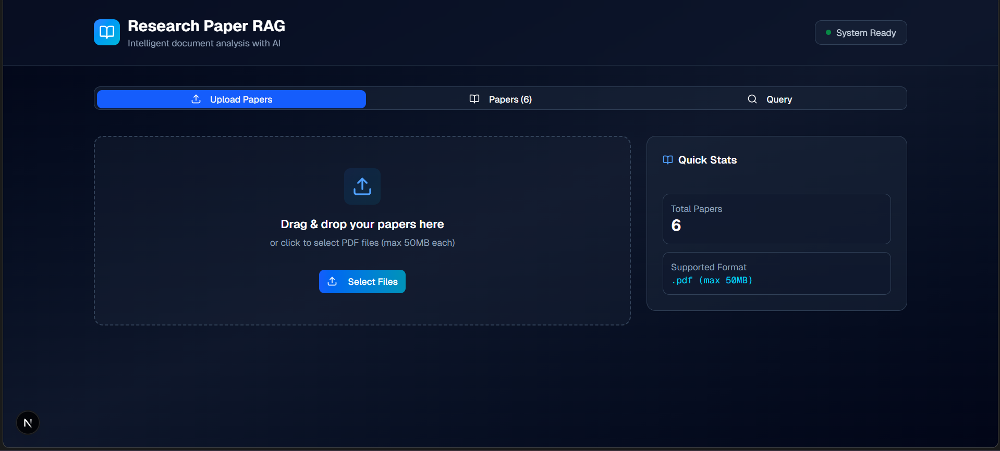
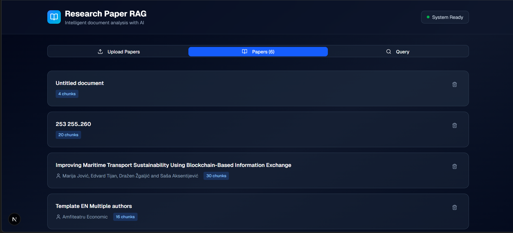
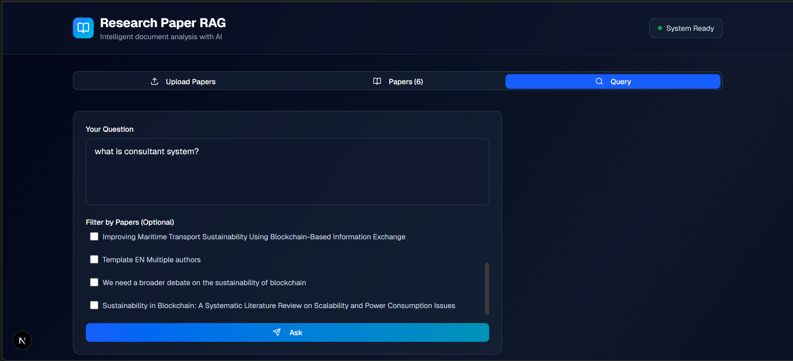

#  Research Paper RAG Assistant

A production-ready **Retrieval-Augmented Generation (RAG)** system that helps researchers efficiently query and understand academic papers. Built with modern full-stack technologies for optimal performance and user experience.

   

## Screenshots








##  Problem Statement

Researchers waste hours reading through multiple papers to find:
- Specific methodologies and approaches
- Key findings and results  
- Dataset information and benchmarks
- Comparative analysis across papers
- Citations and references

**My Solution**: An intelligent assistant that does this in seconds using advanced RAG technology.

---

## ✨ Features

### Core Capabilities

- **📄 Intelligent PDF Processing**: Extract and chunk research papers with section awareness (Abstract, Introduction, Methods, Results, Conclusion)
- **🔍 Semantic Search**: Fast vector similarity search using Qdrant for relevant context retrieval
- **🤖 Multi-LLM Support**: Flexible integration with Ollama, DeepSeek, OpenAI, and OpenRouter
- **💬 Natural Language Queries**: Ask questions in plain English and get accurate, cited answers
- **📊 Citation Tracking**: Every answer includes source citations with paper title, section, page number, and relevance score
- **🎨 Modern UI**: Beautiful, responsive Next.js frontend with dark mode support
- **📈 Real-time Processing**: Upload papers and query them immediately

### Technical Highlights

- **Vector Database**: Qdrant for sub-100ms similarity search
- **Smart Chunking**: Overlapping chunks preserve semantic context
- **Markdown Rendering**: Properly formatted answers with bold text, lists, and structure
- **Comprehensive Logging**: Debug-friendly with `[v0]` prefixed logs
- **Type Safety**: Full TypeScript frontend with Pydantic backend validation
- **Production Ready**: Docker support, error handling, and scalability considerations

---

##  Tech Stack

| Component          | Technology            | Purpose                      |
|--------------------|-----------------------|------------------------------|
| **Frontend**       | Next.js 16 + React 19 | Modern web interface         |
| **Backend**        | Python + FastAPI      | RESTful API service          |
| **Vector DB**      | Qdrant                | Fast similarity search       |
| **Database**       | PostgreSQL/SQLite     | Metadata & query history     |
| **LLM**            | Ollama/DeepSeek/OpenAI/OpenRouter | Answer generation|
| **Embeddings**     | sentence-transformers | Text vectorization           |
| **UI Components**  | shadcn/ui + Tailwind CSS| Beautiful, accessible UI   |
| **Styling**        | Tailwind CSS v4       | Utility-first CSS            |

---

##  Quick Start

### Prerequisites

- **Python 3.10+** (for backend)
- **Node.js 18+** (for frontend)
- **Docker** (for Qdrant)
- **Ollama** (optional, for local LLM) OR API keys for DeepSeek/OpenAI/OpenRouter

### Installation

#### 1. Clone the Repository

```bash
git clone https://github.com/YOUR_USERNAME/research-paper-rag-assessment.git
cd research-paper-rag-assessment
```

#### 2. Backend Setup

```bash
# Create virtual environment
python -m venv venv
source venv/bin/activate  # On Windows: venv\Scripts\activate

# Install dependencies
pip install -r requirements.txt

# Configure environment variables
cp .env.example .env
# Edit .env with your settings (LLM provider, API keys, etc.)
```

#### 3. Start Qdrant (Vector Database)

```bash
# Using Docker
docker run -p 6333:6333 -p 6334:6334 \
  -v $(pwd)/qdrant_storage:/qdrant/storage:z \
  qdrant/qdrant

# Or using docker-compose
docker-compose up -d qdrant
```

#### 4. Start LLM Provider

**Option A: Ollama (Local, Free)**
```bash
# Install Ollama from https://ollama.ai
ollama serve
ollama pull llama2  # or mistral, neural-chat, etc.
```

**Option B: OpenRouter (API, Recommended)**
```bash
# Get API key from https://openrouter.ai
# Add to .env file:
# OPENROUTER_API_KEY=sk-or-v1-your-key-here
# LLM_PROVIDER=openrouter
```

**Option C: DeepSeek or OpenAI**
```bash
# Add respective API keys to .env
# LLM_PROVIDER=deepseek  # or openai
```

#### 5. Start Backend Server

```bash
# From project root
python -m uvicorn src.main:app --reload --host 0.0.0.0 --port 8000
```

Backend will be available at `http://localhost:8000`
API docs at `http://localhost:8000/docs`

#### 6. Frontend Setup

```bash
# Install dependencies
npm install
# or
pnpm install

# Start development server
npm run dev
```

Frontend will be available at `http://localhost:3000`

---

##  Usage

### Upload Research Papers

1. Open the web interface at `http://localhost:3000`
2. Click the upload zone or drag-and-drop PDF files
3. Wait for processing (typically 30-60 seconds per paper)
4. Papers will appear in the "Uploaded Papers" list

### Query Papers

1. Type your question in the query interface
2. Optionally select specific papers to search within
3. Click "Ask Question" or press Enter
4. View the answer with citations and source references

### Example Queries

```
What methodology was used in the transformer paper?

Compare the datasets used across all papers.

What are the key findings about attention mechanisms?

Summarize the results section of the BERT paper.

What evaluation metrics were used?
```

---

## 🔧 Configuration

Edit `.env` file to customize:

```bash
# LLM Provider (ollama, deepseek, openai, openrouter)
LLM_PROVIDER=openrouter
OPENROUTER_API_KEY=sk-or-v1-your-key-here
OPENROUTER_MODEL=deepseek/deepseek-chat

# Qdrant Configuration
QDRANT_HOST=localhost
QDRANT_PORT=6333
QDRANT_COLLECTION=research_papers

# Embeddings
EMBEDDING_MODEL=all-MiniLM-L6-v2
EMBEDDING_DIMENSION=384

# Chunking Strategy
CHUNK_SIZE=512
CHUNK_OVERLAP=100
MIN_CHUNK_LENGTH=50

# RAG Parameters
TOP_K=5
CONFIDENCE_THRESHOLD=0.5

# Debugging
DEBUG=True
```

---

## 📁 Project Structure

```
research-paper-rag-assessment/
├── src/                          # Backend (Python)
│   ├── main.py                   # FastAPI application entry
│   ├── config.py                 # Configuration management
│   ├── models/
│   │   └── schemas.py            # Pydantic models
│   ├── services/
│   │   ├── pdf_processor.py      # PDF extraction & chunking
│   │   ├── embedding_service.py  # Text embeddings
│   │   ├── qdrant_client.py      # Vector DB operations
│   │   └── rag_pipeline.py       # RAG orchestration
│   └── api/
│       └── routes.py             # API endpoints
├── app/                          # Frontend (Next.js)
│   ├── page.tsx                  # Main page
│   ├── layout.tsx                # Root layout
│   ├── globals.css               # Global styles
│   └── api/                      # API routes (if needed)
├── components/                   # React components
│   ├── file-upload-zone.tsx      # PDF upload interface
│   ├── papers-list.tsx           # Papers display
│   ├── query-interface.tsx       # Query UI
│   └── markdown-renderer.tsx     # Answer formatting
├── tests/                        # Unit tests
│   └── test_services.py
├── requirements.txt              # Python dependencies
├── package.json                  # Node.js dependencies
├── docker-compose.yml            # Docker orchestration
├── .env.example                  # Environment template
├── README.md                     # This file
└── APPROACH.md                   # Technical approach doc
```

---

##  API Endpoints

### Upload Paper

```bash
POST /api/papers/upload
Content-Type: multipart/form-data

# Example
curl -F "file=@paper.pdf" http://localhost:8000/api/papers/upload
```

**Response:**
```json
{
  "id": 1,
  "title": "Attention is All You Need",
  "authors": ["Vaswani et al."],
  "year": 2017,
  "chunks_created": 45,
  "status": "success"
}
```

### Query Papers

```bash
POST /api/query
Content-Type: application/json

{
  "question": "What methodology was used?",
  "top_k": 5,
  "paper_ids": [1, 2]  // optional
}
```

**Response:**
```json
{
  "answer": "The transformer architecture uses self-attention mechanisms...",
  "citations": [
    {
      "paper_title": "Attention is All You Need",
      "section": "Methodology",
      "page": 3,
      "relevance_score": 0.89,
      "text_snippet": "We propose a new simple network..."
    }
  ],
  "processing_time": 2.3
}
```

### List Papers

```bash
GET /api/papers
```

### Delete Paper

```bash
DELETE /api/papers/{paper_id}
```

---

##  Testing

```bash
# Run all tests
pytest tests/ -v

# Run with coverage
pytest tests/ --cov=src --cov-report=html

# Run specific test file
pytest tests/test_services.py -v
```

---

##  Troubleshooting

### Qdrant Connection Error

```bash
# Check if Qdrant is running
curl http://localhost:6333/health

# Restart Qdrant
docker restart <container_id>

# Check logs
docker logs <container_id>
```

### Ollama Connection Error

```bash
# Check if Ollama is running
curl http://localhost:11434/api/tags

# Restart Ollama
ollama serve

# Pull model if missing
ollama pull llama2
```

### Frontend Not Connecting to Backend

- Ensure backend is running on `http://localhost:8000`
- Check CORS settings in `src/main.py`
- Verify fetch URL in `components/query-interface.tsx`

### Markdown Not Rendering

- Check that `react-markdown` is installed: `npm list react-markdown`
- Verify `MarkdownRenderer` component is imported correctly
- Check browser console for errors

### Out of Memory

- Reduce `CHUNK_SIZE` in `.env` (try 256)
- Use smaller embedding model: `all-MiniLM-L6-v2` (default)
- Process fewer papers at once
- Increase Docker memory limit

---

##  Deployment

### Docker Deployment

```bash
# Build and run all services
docker-compose up -d

# View logs
docker-compose logs -f

# Stop services
docker-compose down
```

### Production Checklist

- [ ] Set `DEBUG=False` in `.env`
- [ ] Use production LLM provider (not Ollama)
- [ ] Set up PostgreSQL database (not SQLite)
- [ ] Enable authentication and authorization
- [ ] Configure CORS for production domain
- [ ] Set up SSL/TLS certificates
- [ ] Implement rate limiting
- [ ] Set up monitoring and logging
- [ ] Use environment secrets management
- [ ] Configure backup strategy for vector DB

### Vercel Deployment (Frontend)

```bash
# Install Vercel CLI
npm i -g vercel

# Deploy
vercel --prod
```

### Backend Deployment Options

- **Railway**: Easy Python deployment
- **Render**: Free tier available
- **AWS EC2**: Full control
- **Google Cloud Run**: Serverless containers
- **DigitalOcean**: Simple VPS

---

##  Performance Benchmarks

| Task | Time | Notes |
|------|------|-------|
| Upload 10-page PDF | 30-60s | Includes extraction, chunking, embedding, indexing |
| Generate query embedding | 100-200ms | Single query |
| Vector search (1000 papers) | 50-100ms | Top 5 results |
| LLM generation | 2-5s | Depends on provider |
| **Total query latency** | **2.5-6s** | End-to-end |

### Scaling Targets

| Metric | Target | Strategy |
|--------|--------|----------|
| Papers | 100,000+ | Sharded Qdrant + caching |
| Queries/min | 1000+ | Load balanced API + queue |
| Avg response time | <3s | Caching + optimization |
| Storage | <100GB | Vector compression |

---

##  Contributing

Contributions are welcome! Please follow these steps:

1. Fork the repository
2. Create a feature branch (`git checkout -b feature/amazing-feature`)
3. Commit your changes (`git commit -m 'Add amazing feature'`)
4. Push to the branch (`git push origin feature/amazing-feature`)
5. Open a Pull Request

---

##  License

This project is licensed under the MIT License - see the [LICENSE](LICENSE) file for details.

---

##  Acknowledgments

- **Qdrant** for the excellent vector database
- **sentence-transformers** for embedding models
- **FastAPI** for the modern Python web framework
- **Next.js** and **Vercel** for the amazing frontend framework
- **shadcn/ui** for beautiful UI components
- **OpenRouter** for unified LLM API access

---

##  Contact

For questions or support, please open an issue on GitHub or contact the maintainers.

---
